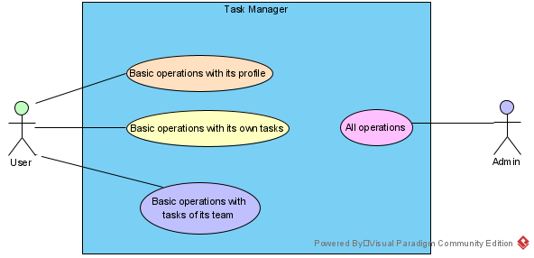
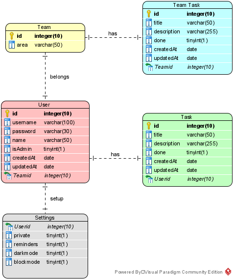

<!-- PROJECT SHIELDS -->

[![Contributors][contributors-shield]][contributors-url]
[![Forks][forks-shield]][forks-url]
[![Stargazers][stars-shield]][stars-url]
[![Issues][issues-shield]][issues-url]
[![LinkedIn][linkedin-shield]][linkedin-url]

<!-- PROJECT LOGO -->
<br />
<p align="center">
  <a href="https://github.com/Nxssie/angular-node-sequelize">
    
  </a>
</p>

<h3 align="center">Task Manager</h3>

<p align="center">
  A simple responsive task manager.
  <br />
  <a href="https://github.com/Nxssie/angular-node-sequelize"><strong>Explore the docs »</strong></a>
  <br />
  <br />
  <a href="https://xd.adobe.com/view/19b25eaf-befe-446d-9dac-c69c163cc6ad-4ce1/">View Mockup</a>
  ·
  <a href="https://github.com/Nxssie/angular-node-sequelize/issues">Report Bug</a>
  ·
  <a href="https://github.com/Nxssie/angular-node-sequelize/issues">Request Feature</a>
</p>

<!-- TABLE OF CONTENTS -->
<details open="open">
  <summary>Table of Contents</summary>
  <ol>
    <li>
      <a href="#about-the-project">About The Project</a>
      <ul>
        <li><a href="#built-with">Built With</a></li>
      </ul>
    </li>
    <li>
      <a href="#getting-started">Getting Started</a>
      <ul>
        <li><a href="#prerequisites">Prerequisites</a></li>
        <li><a href="#installation">Installation</a></li>
      </ul>
    </li>
    <li><a href="#usage">Usage</a></li>
    <li><a href="#roadmap">Roadmap</a></li>
    <li><a href="#contributing">Contributing</a></li>
    <li><a href="#license">License</a></li>
    <li><a href="#contact">Contact</a></li>
    <li><a href="#acknowledgements">Acknowledgements</a></li>
  </ol>
</details>

<!-- ABOUT THE PROJECT -->

## About The Project

This simple application provides users with the ability to manage their day-to-day tasks. Allowing them to set a title, which will act as a summary of the task and a description, which will be the content of it.

#### Use case Diagram

<p align="center">
  
</p>

#### Entity-Relationship Diagram

<p align="center">
  
</p>

#### Technology comparison

###### Angular vs React vs Vue

[Extended Comparison](https://www.codeinwp.com/blog/angular-vs-vue-vs-react/)

<!-- Table -->
<div align="center">
<table width="100%">
<caption>The history of Angular vs React vs Vue</caption>
<thead>
<tr>
<th width="25%"></th>
<th width="25%"><strong>Angular</strong></th>
<th width="25%"><strong>React</strong></th>
<th width="25%"><strong>Vue</strong></th>
</tr>
</thead>
<tbody>
<tr>
<td>Initial release</td>
<td>2010</td>
<td>2013</td>
<td>2014</td>
</tr>
<tr>
<td>Official site</td>
<td><a href="https://angular.io" target="_blank" rel="noopener">angular.io</a></td>
<td><a href="https://reactjs.org" target="_blank" rel="noopener">reactjs.org</a></td>
<td><a href="https://vuejs.org" target="_blank" rel="noopener">vuejs.org</a></td>
</tr>
<tr>
<td>Approx. size (KB)</td>
<td>500</td>
<td>100</td>
<td>80</td>
</tr>
<tr>
<td>Current version</td>
<td>11</td>
<td>17.x</td>
<td>3.x</td>
</tr>
<tr>
<td>Used by</td>
<td>Google, Wix</td>
<td>Facebook, Uber</td>
<td>Alibaba, GitLab</td>
</tr>
</tbody>
</table>
</div>

<br/>

<!-- Angular -->

<br/>
<p align="center">
  

  <p>Angular is the most mature of the frameworks, has good backing in terms of contributors and is a complete package. However, the learning curve is steep and concepts of development in Angular may put off new developers. Angular is a good choice for companies with large teams and developers who already use TypeScript.</p>
  
</p>

<!-- React -->
<p align="center">
  

  <p>React is just old enough to be mature and has a huge number of contributions from the community. It has gained widespread acceptance. The job market for React is really good, and the future for this framework looks bright. React looks like a good choice for someone getting started with front-end JavaScript frameworks, startups and developers who like some flexibility. The ability to integrate with other frameworks seamlessly gives it a great advantage for those who would like some flexibility in their code.</p>
</p>

<!-- Vue -->

<br/>
<p align="center">
  

  <p>Vue is newest to the arena, without the backing of a major company. However, it has done really well in the last few years to come out as a strong competitor for Angular and React. This is perhaps playing a role with a lot of Chinese giants like Alibaba and Baidu picking Vue as their primary front-end JavaScript framework. However, it remains to be seen how it does in the future and one is justified to be cautious with it. Vue should be your choice if you prefer simplicity, but also like flexibility.</p>
  
</p>

### Built With

- [NodeJS](https://nodejs.org/es/)
- [Sequelize](https://sequelize.org)
- [MySql](https://www.mysql.com)
- [Angular](https://angular.io)

<!-- GETTING STARTED -->

## Getting Started

To get a local copy up and running follow these simple steps.

### Prerequisites

This is an example of how to list things you need to use the software and how to install them.

- npm
  ```sh
    npm install npm@latest -g
  ```
- Angular CLI
  ```sh
    npm install @angular/cli -g
  ```

### Installation

1. Clone the repo
   ```sh
   git clone https://github.com/Nxssie/angular-node-sequelize.git
   ```
2. Read [Usage](#usage)

<!-- USAGE EXAMPLES -->

## Usage

As it is a full stack application. We will have server-side usage and client-side usage. You can check each individually on the wiki provided.

_Please refer to the [Task Manager Wiki](https://github.com/Nxssie/angular-node-sequelize/wiki)._

<!-- ROADMAP -->

## Roadmap

See the [open issues](https://github.com/Nxssie/angular-node-sequelize/issues) for a list of proposed features (and known issues).

<!-- CONTRIBUTING -->

## Contributing

Contributions are what make the open source community such an amazing place to be learn, inspire, and create. Any contributions you make are **greatly appreciated**.

1. Fork the Project
2. Create your Feature Branch (`git checkout -b feature/AmazingFeature`)
3. Commit your Changes (`git commit -m 'Add some AmazingFeature'`)
4. Push to the Branch (`git push origin feature/AmazingFeature`)
5. Open a Pull Request

<!-- LICENSE -->

## License

Distributed under the MIT License. See `LICENSE` for more information.

<!-- CONTACT -->

## Contact

Nxssie - [@NxssieDev](https://twitter.com/NxssieDev) - nxssiedev@gmail.com

Project Link: [https://github.com/Nxssie/angular-node-sequelize](https://github.com/Nxssie/angular-node-sequelize)

<!-- ACKNOWLEDGEMENTS -->

## Acknowledgements

- [Angular Documentation](https://angular.io/docs)
- [Sequelize Documentation](https://sequelize.org/master/)
- [Tcrurav Github](https://github.com/tcrurav)

<!-- MARKDOWN LINKS & IMAGES -->
<!-- https://www.markdownguide.org/basic-syntax/#reference-style-links -->

[contributors-shield]: https://img.shields.io/github/contributors/Nxssie/angular-node-sequelize.svg?style=for-the-badge
[contributors-url]: https://github.com/Nxssie/angular-node-sequelize/graphs/contributors
[forks-shield]: https://img.shields.io/github/forks/Nxssie/angular-node-sequelize.svg?style=for-the-badge
[forks-url]: https://github.com/Nxssie/angular-node-sequelize/network/members
[stars-shield]: https://img.shields.io/github/stars/Nxssie/angular-node-sequelize.svg?style=for-the-badge
[stars-url]: https://github.com/Nxssie/angular-node-sequelize/stargazers
[issues-shield]: https://img.shields.io/github/issues/Nxssie/angular-node-sequelize.svg?style=for-the-badge
[issues-url]: https://github.com/Nxssie/angular-node-sequelize/issues
[license-shield]: https://img.shields.io/github/license/Nxssie/angular-node-sequelize.svg?style=for-the-badge
[license-url]: https://github.com/Nxssie/angular-node-sequelize/blob/master/LICENSE.txt
[linkedin-shield]: https://img.shields.io/badge/-LinkedIn-black.svg?style=for-the-badge&logo=linkedin&colorB=555
[linkedin-url]: https://www.linkedin.com/in/carlos-sánchez-b549951a1/
